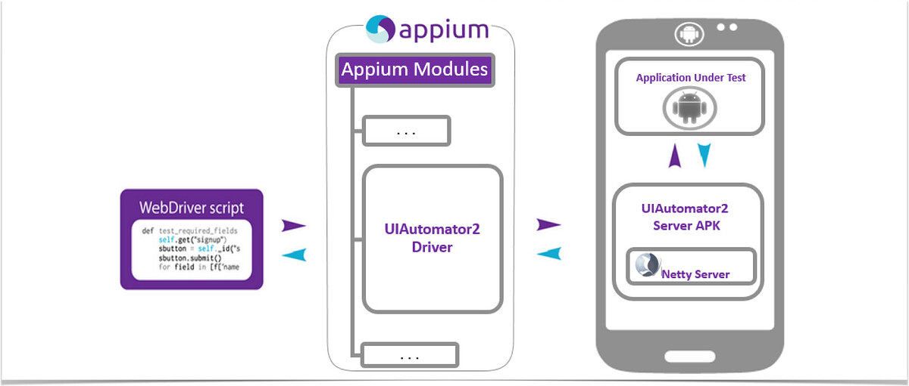
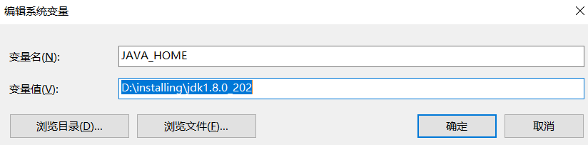
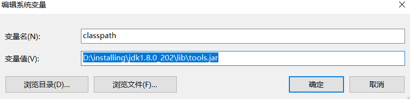
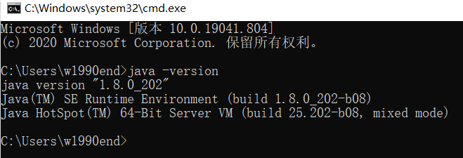
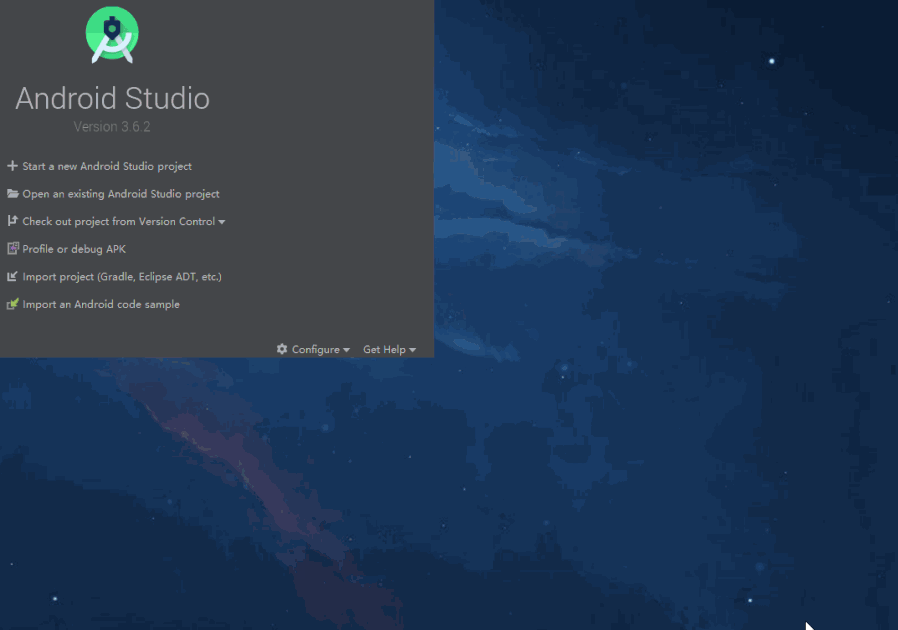
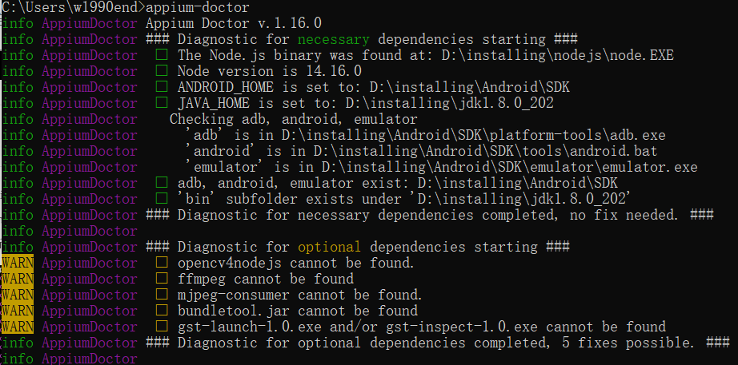

# appium的环境安装与架构

* Appium是一个移动端的自动化测试框架，可用于测试原生应用，移动网页应用和混合应用， 且是跨平台的。可用于IOS和Android操作系统。原生应用是指用Android或IOS编写的应用，
  移动网页应用是指网页应用，类似于IOS中safari应用或者Chrome应用或者类似浏览器的应用 。混合应用是指一种包裹webview的应用，原生应用网页内容交互性的应用。

* 重要的是Appium是一个跨平台的测试框架，意思是可以针对不同平台用一套API来编写脚本。

# appium介绍

为什么推荐appium？

* appium是支持跨语言：Java、python、nodejs等
* appium是跨平台的：
  * Android、IOS
  * windows、Mac

* 底层多引擎可切换
* 生态丰富，社区强大

# appium引擎列表

* Android的引擎
  * espresso
  * selendroid
  * uiautomator
  * uiautomator2[推荐使用]
* IOS的引擎
  * uiautomation
  * xcuitest[推荐使用]
* Mac
* windows

# appium的设计理念

* webdriver是基于http协议的，第一连接会建立一个session会话，并通过post发送一个 json告知服务端相关信息
* Client/Server设计模式
  * 客户端通过WebDriver json wire协议与服务器端通讯
  * 多语言支持
* Server可以放在任何地方
* 服务端NODEJS开发的HTTP服务
* appium使用appium-xcuitest-driver来测试iphone设备，其中需要安装facebook出的 WDA(webdriver agent)来驱动iOS测试。

# appium框架结构



# appium生态工具

* adb：Android的控制工具，用于获取Android的各种数据和控制
* appium desktop：内嵌了appium server和inspector的综合工具
* appium server：appium的核心工具，命令行工具
* appium client：各种语言的客户端封装库，用于连接appium server
  * python、java、ruby、robotframework-appium
    *AppCrawler：自动遍历工具

# appium环境安装

* 1、安装jdk（1.8版本）
  * [官网下载地址](https://www.oracle.com/java/technologies/javase/javase-jdk8-downloads.html)
  * 下载完成，一直点下一步安装，路径可以自己选择或者可以使用默认路径
  * 配置环境变量(windows),以下是以win10系统为例：
    * 在系统变量里面新建'JAVA_HOME'变量，变量值为：D:\installing\jdk1.8.0_202，如下图：
      
    * 在系统变量里面新建'classpath'变量：变量值为：D:\installing\jdk1.8.0_202\lib\tools.jar，如图：
      
    * 找到path变量（已存在不用新建），在path变量里添加：D:\installing\jdk1.8.0_202\bin;D:\installing\jdk1.8.0_202\jre\bin 如下图：
      
  * 检查JAVA环境是否配置好：
    * 进入cmd界面，输入java -version或者javac -version,查看有版本号输出即为成功，如图：
      


* 2、安装SDK
  * 安装Android Studio
    * [官网下载地址](https://developer.android.google.cn/studio/#downloads)
    * 通过官网下载Android Studio对应版本后，直接安装即可
  * 初始化Android环境、安装SDK
    * 安装Android Studio之后初次启动的时候会需要进行环境的初始化，安装的时候使用标准安装即可。现在国内可以正常访问dl.google.com这个域名了， 所以不用配置特殊手段也可以正常安装SDK等内容
  * 修改build-tools版本
    * 由于默认会安装最新版本的bulid-tools，但是30版本开始build-tools配合jdk1.8会报错，所以需要手动降级到29版本。如下图：
      
  * 配置环境变量
    * win
      * 在系统变量中新建一个变量，名字为ANDROID_HOME，值为电脑SDK的根目录，一般默认安装的路径为C:\Users\用户名\AppData\Local\Android\Sdk
        （用户名为你电脑登录用户的用户名），可以去自己的文件夹下查看具体路径，不要写错
      * 修改系统变量中的path变量，添加四条内容,因为可能会有其他软件也带有adb执行文件，未免出现问题，尽量将这四项配置到较靠前的位置
        ```markdown
        %ANDROID_HOME%\emulator   
        %ANDROID_HOME%\tools   
        %ANDROID_HOME%\tools\bin   
        %ANDROID_HOME%\platform-tools
        ```
    * linux/Mac
      * 在环境变量中配置ANDROID_HOME变量，值为SDK的根目录，之后将四个文件夹配置到path变量中，并使用source命令或者重启让配置生效,
        ```markdown
        $ANDROID_HOME/platform-tools   
        $ANDROID_HOME/emulator
        $ANDROID_HOME/tools
        $ANDROID_HOME/tools\bin
        ```        
  * 确认配置是否生效
    * 在命令行执行adb version,确认没有报错，提示的adb位置是之前所安装的sdk目录下
    * 在命令行执行emulator -version，确认没有报错，并且显示了Android emulator version信息


* 3、安装appium desktop（appium server + appium inspector工具）
  * 下载对应操作系统的安装包：[appium desktop地址](https://github.com/appium/appium-desktop/releases)
    * 下载下来一步步安装就可以了
  * 如果不需要appium inspector,也可以通过npm直接安装appium
    * 官方安装（不推荐）
      * npm install -g appium
    * 淘宝提供（推荐）
      * npm install -g cnpm --registry=https://registry.npm.taobao.org
      * cnpm install -g appium
    * 运行
      * 命令行界面运行appium（不报错说明安装成功）


* 4、安装appium python client
  * 方式一：pip install appium-python-client(推荐)
  * 方式二：下载源码包：
    * [下载地址一](https://github.com/appium/python-client)  
      [下载地址二](https://pypi.org/project/Appium-Python-Client/)
    * 解压后在命令行中进入python-client-master目录，该目录下包含setup.py文件
      *执行命令python setup.py install命令安装客户端

* 5、安装appium-doctor检测appium的安装环境
  * cnpm install appium-doctor
  * 在命令行执行appium-doctor，出现以下图说明安装成功：
    


* 最后运行测试用例验证appium的环境是否成功
  * 首先打开appium desktop，点击start server，不报错
  * 其次准备一个Android设备，真机或者模拟器，连接到电脑上并且通过adb devices查看设备是否连接
  * 最后编写测试脚本，运行脚本,如下：
    ```python
    from appium import webdriver
    desired_caps={}
    desired_caps['platformName']='Android'
    desired_caps['platformVersion'] = '6.0'
    desired_caps['deviceName'] = '127.0.0.1:7555'
    desired_caps['appPackage'] = 'com.android.settings'
    desired_caps['appActivity'] = '.Settings'
    driver = webdriver.Remote('http://127.0.0.1:4723/wd/hub',desired_caps)
    driver.quit()
    ```
  


